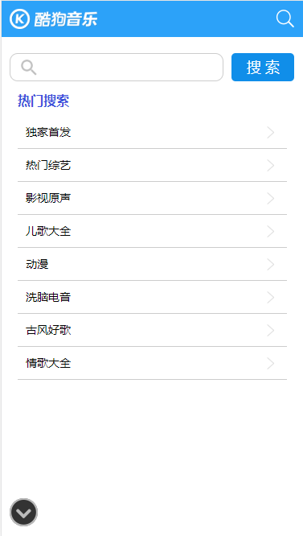

#### 仿酷狗音乐，仅用于学习
#### 技术栈
```
    React + React-router + antd-mobile + TypeScript
```
#### 项目功能
- [x] 首页-新歌栏
- [x] 搜索
- [x] 热门歌单列表
- [x] 歌单详情页
- [x] 排行榜
- [x] 榜单详情页
- [x] 歌手
- [x] 歌手详情页
- [ ] 歌曲播放（由于音源接口问题，这个功能暂时做不了）

#### 项目部分截图



---
#### 项目运行
```
    npm  start
```
